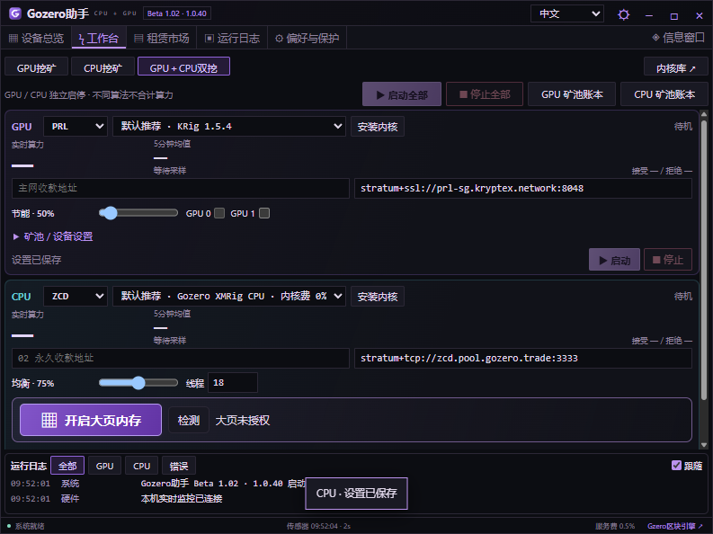
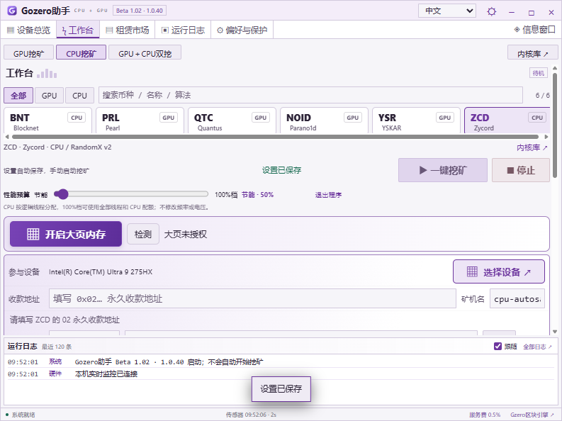
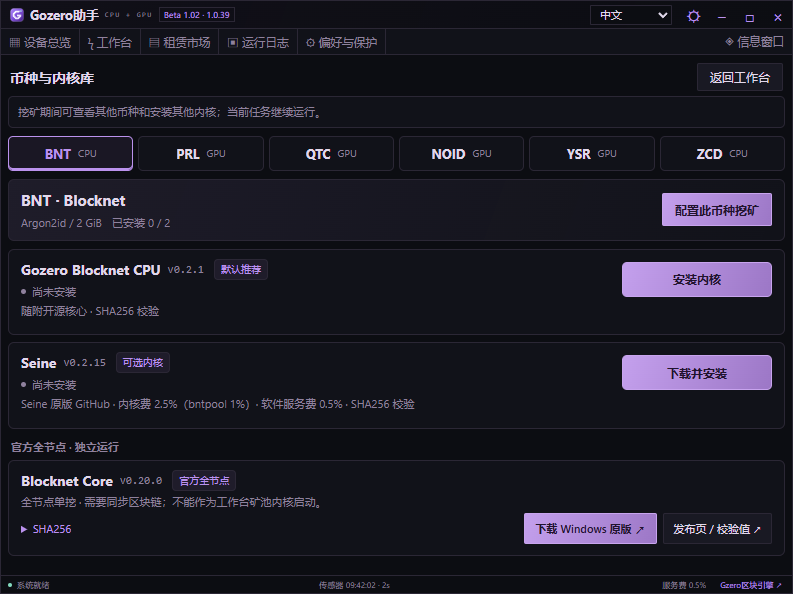
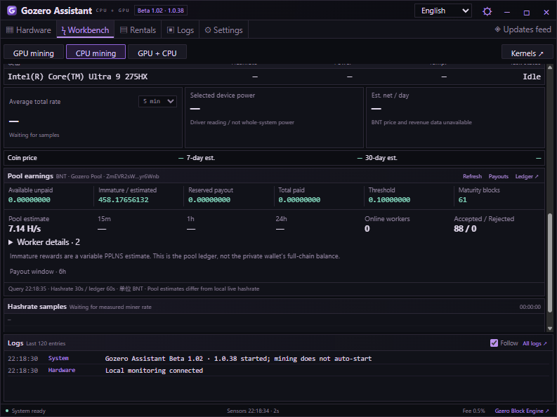
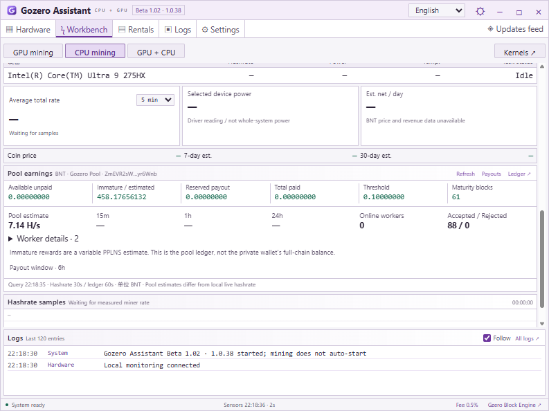
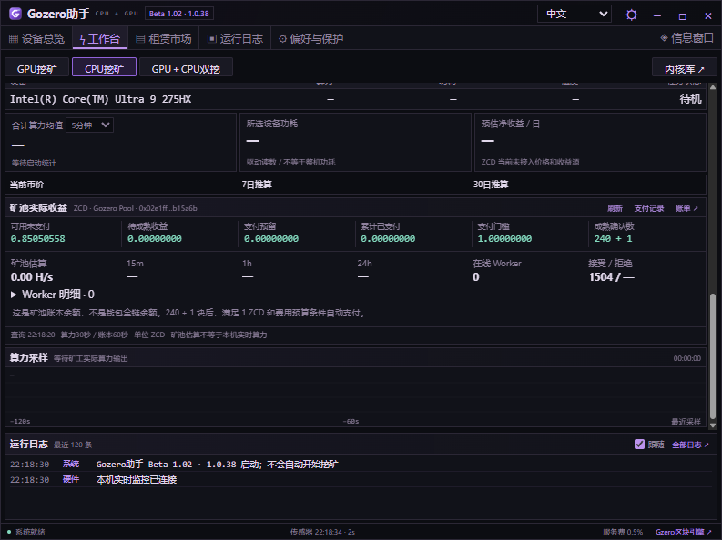

# Gozero Assistant · Beta 1.02 (1.0.40)

**English** | [简体中文](README.zh-CN.md)

A compact Windows GPU / CPU mining assistant with hardware monitoring, independent GPU + CPU tasks, pool account data, a rental marketplace and a floating desktop monitor.

[Download for Windows](https://github.com/AlexZeroZero/GozeroAssistant/releases/tag/v1.0.40-beta) · [Website](https://gozero.trade/) · [User guide](desktop/QUICKSTART.txt) · [Build guide](desktop/README.md)

## Download and upgrade

Download `GozerAssistant-1.0.40-win-x64.zip`, verify the accompanying SHA256 checksum, extract the entire archive to a new folder and run `GozerAssistant.exe`. Exit the old app from its tray menu before upgrading. Existing local wallet/pool settings are preserved. Mining never starts automatically on app launch.

The display version remains **Beta 1.02**; the internal update version is **1.0.40**.

## What's new

- **Automatic settings saves:** release the performance slider to save GPU/CPU budgets automatically; CPU thread counts follow the selected mode. Single and dual workbenches show save status. Launch waits for saving; validation failures preserve drafts and prevent launch.
- **Simpler workbench:** redundant Apply/Save/Settings buttons removed. Wallets, pools and thread edits save when editing finishes; advanced dual-task options remain in an expandable row.
- **Aligned kernel library:** consistent names, versions, status and install buttons, with a separate official full-node section. The device-selection button is larger.
- **BNT pool migration:** default remains `stratum+tcp://bnt.pool.gozero.trade:14444`; older default-port settings are migrated without replacing custom pools.

- **YSR / ZCD / BNT Gozero Pool accounts:** read-only public-address queries show pool-side hashrate estimates, workers, accepted/rejected shares, balances and paginated payments. The GPU + CPU workbench has separate account buttons for each task.
- **Correct accounting:** YSR full-chain balance and indexed pool rewards are separate. ZCD/BNT show available unpaid, immature, reserved and confirmed paid amounts separately. BNT immature amounts remain explicitly labeled as variable PPLNS estimates.
- **Exact amounts and reliable refresh:** 8-decimal integer-string/BigInt conversion; mining polls about every 30s and accounts every 60s. Errors back off and retain data as stale; unknown metrics stay unavailable. Custom pools are not attributed to Gozero Pool.
- **BNT CPU engines:** Gozero Blocknet CPU 0.2.1 is recommended; Seine 0.2.15 can be downloaded and selected. The official Core 0.20.0 full-node download is listed separately; it requires chain sync and cannot run as a workbench pool worker.
- **BNT tuning and memory budgeting:** threads depend on available RAM and logical CPUs, with system headroom. Optional large-page setup and measured auto-tuning are available for the Gozero kernel. The new AVX2 stream path is a candidate, not an unconditional default.

| Coin | Hardware / algorithm | Engine / default connection |
| --- | --- | --- |
| BNT | CPU / Argon2id, 2 GiB per thread | Gozero Blocknet CPU or optional Seine; `stratum+tcp://bnt.pool.gozero.trade:14444` |
| ZCD | CPU / RandomX v2 | Gozero XMRig CPU or official XMRig; `stratum+tcp://zcd.pool.gozero.trade:3333` |
| YSR | NVIDIA SM 8.0+ / SHA-256d | Gozero YSR CUDA; `https://ysr.pool.gozero.trade:8443` |
| NOID | Supported NVIDIA GPUs / Poseidon2b | Suprminer or Fl4shMiner; primary / backup selection |
| PRL / QTC | Upstream-supported GPUs | KRig; regional and backup pool options |

YSR requires a CUDA 13-compatible driver; AMD/CPU YSR and Windows TSC mining are not enabled. ZCD needs at least 4 GiB available RAM. BNT reserves roughly 2 GiB + 128 MiB per thread plus system headroom; more threads do not always mean more hashrate.

## Current interface

1.0.40 automatic-save workbench (idle; no mining started):








These **1.0.38 screenshots show real read-only pool data for a configured public test address while local mining is idle**. Pool estimates and past ledger amounts do not establish new earnings or local mining speed.







## Other features

- Independent GPU + CPU configurations, start/stop controls, logs and five-/ten-minute hashrate averages. Rates from different algorithms are not added together.
- Hardware inventory, supported live sensors, a draggable floating monitor, system tray controls and a 90°C default GPU protection threshold. CPU temperature and power monitoring are not integrated.
- Chinese, English, Japanese and Russian interfaces; dark and light themes.
- Clore / Vast.ai GPU and CPU rental listings, model filters and rental estimates. The app does not rent or pay automatically.

[Clore referral](https://clore.ai/register?ref_id=ebgzlv4d) · [Vast.ai referral](https://cloud.vast.ai/?ref_id=133254)

## Fees and verification limits

Gozero charges a disclosed **0.5% mining-time service fee**. This is not an exact per-coin payout deduction. Engine fees, pool fees and electricity costs are separate. Gozero BNT has 0% engine fee; original Seine has **2.5%** (1% on bntpool.com/subdomains). Original XMRig has 1%; the optional Gozero CPU build has 0% engine fee.

185 automated tests and the 1.0.40 automatic-save UI checks passed. The 1.0.38 read-only pool/API checks also passed. **Seine's launch inside the Assistant was blocked on the test host (Windows error 5 and a Tencent security prompt); its end-to-end in-app mining has not been accepted there.** No security settings were bypassed. BNT performance gains vary by device and thread count; no 3995WX or AVX-512 improvement is promised. See [validation scope](desktop/VALIDATION.md).

## Source and building

```powershell
git clone https://github.com/AlexZeroZero/GozeroAssistant.git
cd GozeroAssistant
python desktop/scripts/package.py
```

Windows x64, Python 3.11+ and the .NET Framework C# compiler are required. Tests require Node.js 22+. The build verifies a pinned Electron runtime and does not start mining.

Assistant code is [MIT](LICENSE). Upstream components retain their own licenses; see [third-party notices](desktop/THIRD-PARTY.md). Gozero XMRig follows GPL-3.0-or-later: [optional engine and corresponding source](https://github.com/AlexZeroZero/GozeroAssistant/releases/tag/xmrig-cpu-6.26.0-cpu.2). KRig, Suprminer, Fl4shMiner, XMRig and Seine download only at the user's request. Mining software can trigger antivirus detection; no detection-free guarantee is made.
