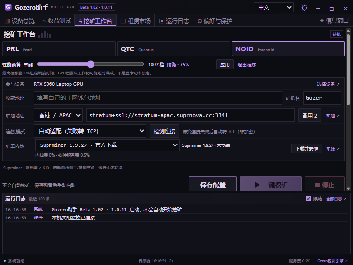
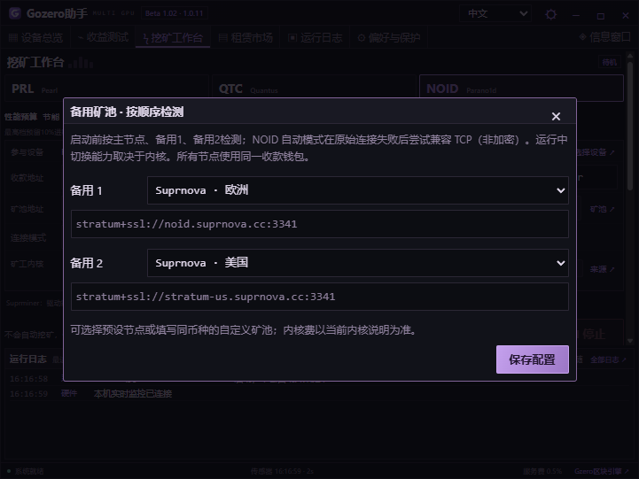
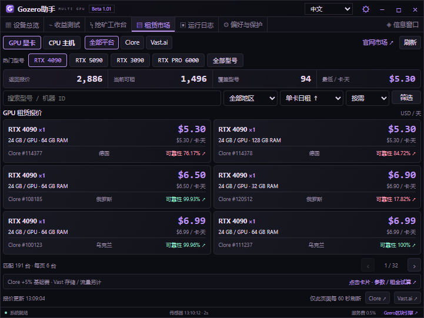
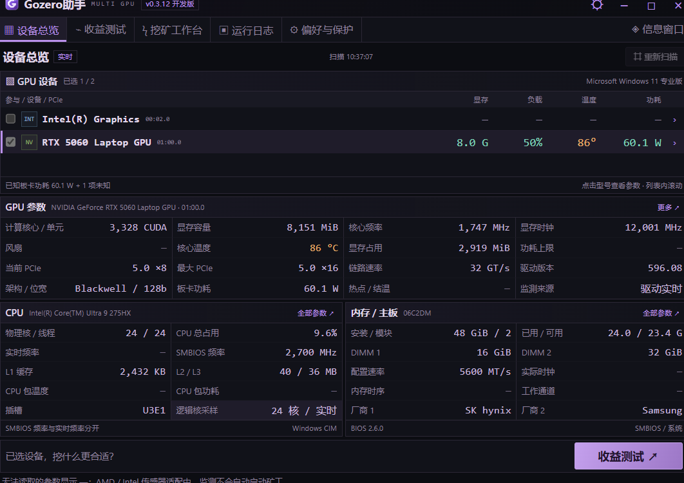
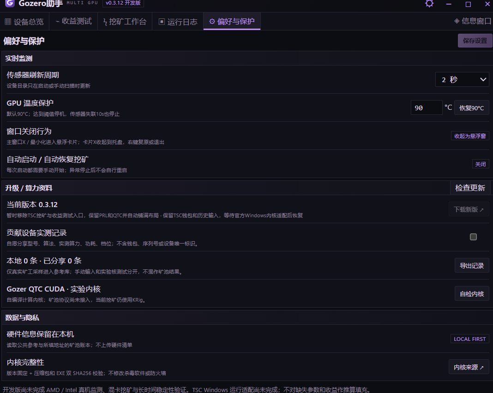
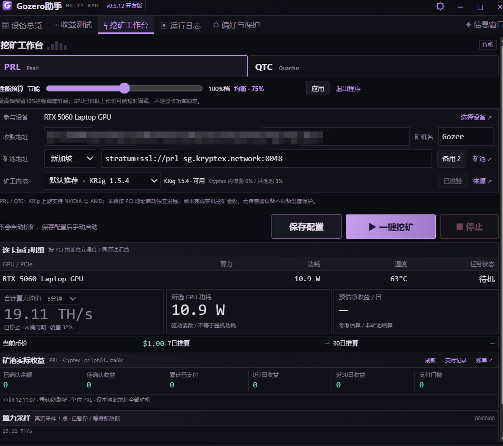
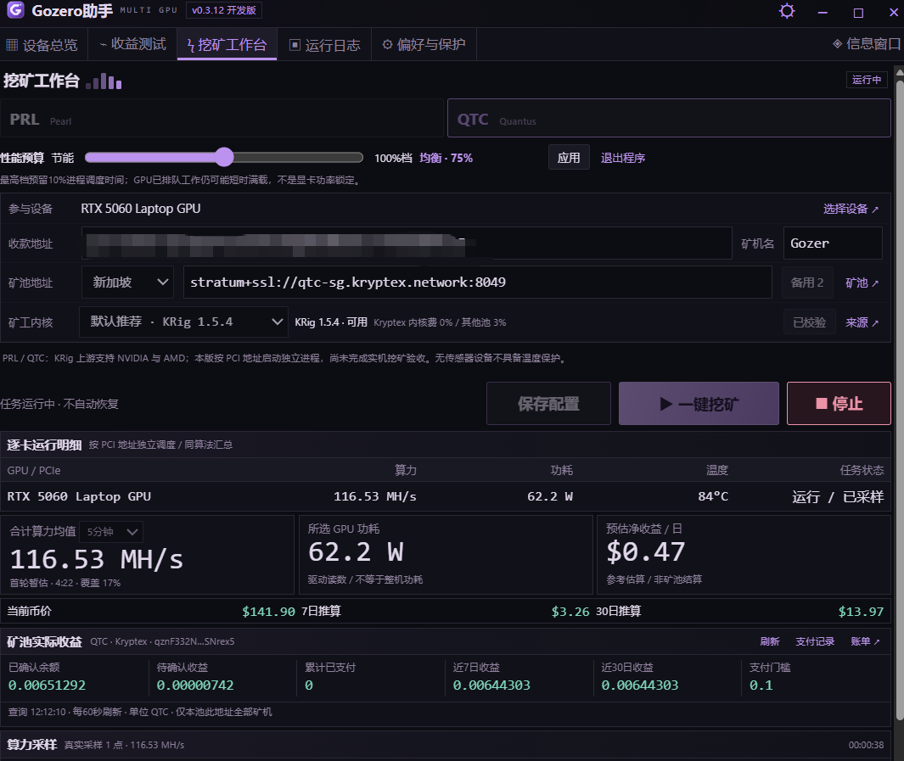
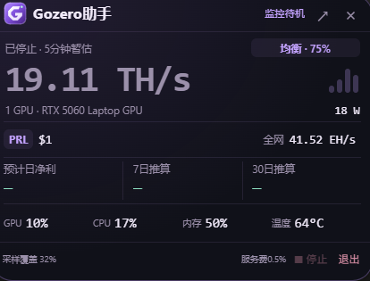
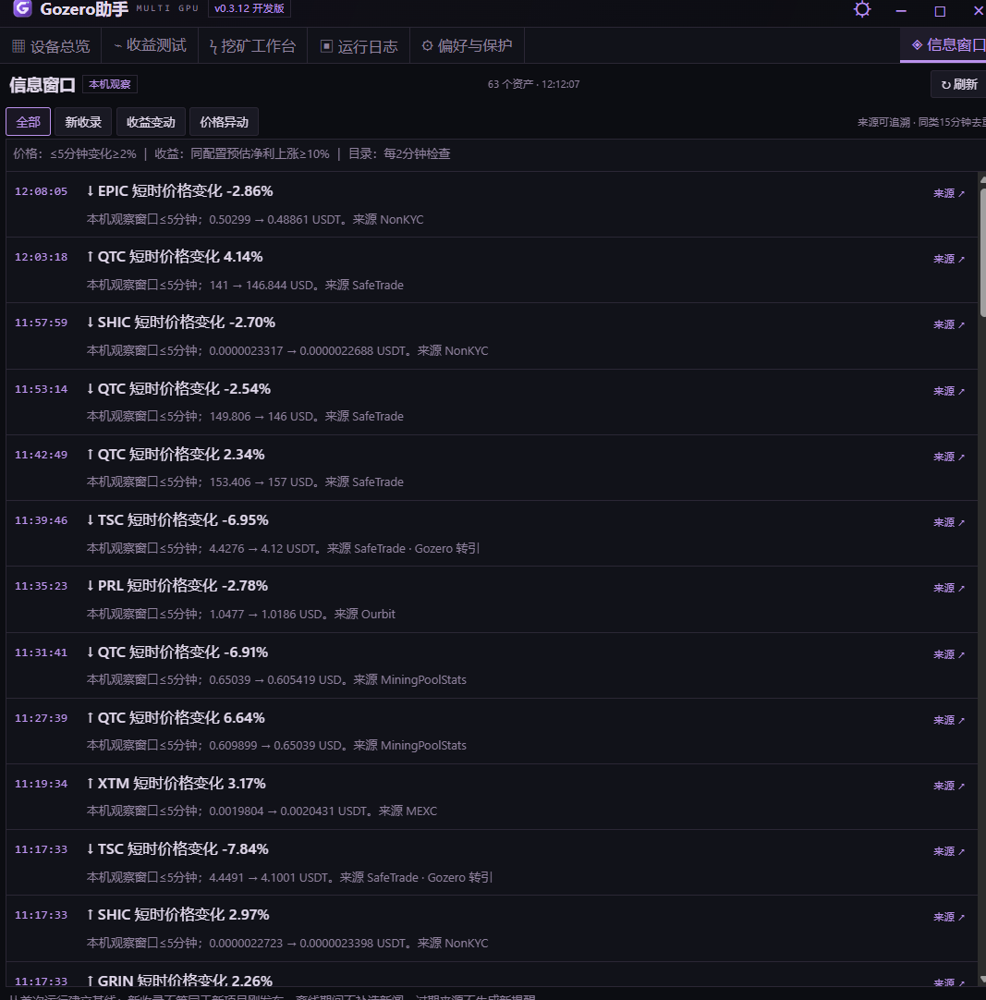

# Gozero助手 · Beta 1.02

Windows GPU 挖矿助手，提供紧凑的硬件监测、PRL / QTC / NOID 挖矿工作台、参考收益与桌面悬浮卡片。

[软件下载](https://github.com/AlexZeroZero/GozeroAssistant/releases/tag/beta-1.02) · [使用指南](desktop/QUICKSTART.txt) · [构建说明](desktop/README.md) · [官网](https://gozero.trade/)

## 下载与使用

在 Releases 下载 `GozerAssistant-1.0.11-win-x64.zip`，完整解压后运行 `GozerAssistant.exe`。SHA256 校验文件与安装包同时提供。

请保留整个解压文件夹。升级前从托盘退出旧版，再解压新版运行；钱包和配置保存在本机并会继续保留。

显示版本 **Beta 1.02**；内部更新版本为 `1.0.11`，确保旧版能正常识别升级。

## 本版更新（1.0.11）

- NOID 使用官方 Suprminer / Fl4shMiner，默认推荐 Suprminer；移除自研 NOID 内核选项及随包运行文件。
- 自动检测主、备用矿池的原始连接；失败后尝试官方 Suprnova 节点的兼容 TCP（非加密），并显示实际节点。
- 备用矿池支持下拉选择地区、停用和自定义地址；全局字体放大约8%，矿池设置进一步加大。
- 旧配置迁移至自动连接模式，钱包和矿池配置保留；不会自动开始挖矿。

连接检测仅验证 NOID 协议响应，不等于已提交有效份额。软件0.5%服务费的调度和地址切换测试已通过，但完整的服务地址有效份额与实收链路尚未验收。




## 功能

- GPU、CPU、内存、主板和 BIOS 参数读取；显示已支持的传感器数据。
- 新增 GPU / CPU 租赁市场：Clore + Vast.ai 实时报价、每页六台、平台/地区/规格筛选及按需/竞价排序。
- 4090、5090、3090、RTX PRO 6000 快捷筛选；可拖动参数窗、租期试算，跳转使用指定推荐链接。
- 租赁页面可见时每60秒刷新，保留缓存与卡片位置；失败和过期状态明确标注。
- PRL / QTC / NOID 挖矿、主备矿池、多卡选择与逐卡日志。
- 5分钟或10分钟算力均值、参考收益、60秒实际挖矿测试与 Kryptex 地址账本。
- 节能、均衡、高性能预算；默认90°C GPU温度保护。
- 可拖动悬浮卡片及系统托盘；显示设备算力、当前模式、负载和收益。
- 中文、English、日本語、Русский 即时切换并记忆，同步主窗口、悬浮卡片和托盘菜单。
- 挖矿停止后，悬浮卡片突出显示“已停止”，保留历史算力供参考。

官方发行版的软件服务费为0.5%，挖矿和收益测试均适用，按有效GPU运行时间分时累计；不是按币量精确扣款。矿工内核费、矿池费及电费另计，详细规则见使用指南和程序底部。

当前 TSC 挖矿入口未开放。QTC 实验计算核用于离线自检；实际 PRL/QTC 挖矿使用 KRig。

## 租赁市场



[Clore 推荐链接](https://clore.ai/register?ref_id=ebgzlv4d) · [Vast.ai 推荐链接](https://cloud.vast.ai/?ref_id=133254)

截图报价仅代表截取时状态。Clore 另加5%基础费；Vast 存储与流量另计。程序只提供查询与跳转，不自动租赁或支付。

## 测试截图

以下为用户提供的 v0.3.12 开发版实测截图，用于展示设备参数、挖矿工作台和悬浮监控等界面；当前发行版为 **Beta 1.02**。截图中的算力、价格和收益仅代表截图时的设备与采样状态，实际数据以当前运行结果为准。点击图片可查看原图。

<table>
  <tr>
    <td width="50%" valign="top"><strong>设备总览</strong><br>GPU、CPU、内存及 PCIe 参数<br><a href="docs/screenshots/hardware-overview.png"></a></td>
    <td width="50%" valign="top"><strong>偏好与保护</strong><br>温度保护、监测周期与设备记录设置<br><a href="docs/screenshots/preferences-protection.png"></a></td>
  </tr>
  <tr>
    <td valign="top"><strong>PRL 挖矿工作台</strong><br>矿池配置、设备状态与矿池账本<br><a href="docs/screenshots/prl-workbench.png"></a></td>
    <td valign="top"><strong>QTC 挖矿工作台</strong><br>运行算力、功耗、温度与参考收益<br><a href="docs/screenshots/qtc-workbench.png"></a></td>
  </tr>
  <tr>
    <td valign="top"><strong>桌面悬浮监控</strong><br>设备算力、性能模式与系统负载<br><a href="docs/screenshots/floating-monitor.png"></a></td>
    <td valign="top"><strong>信息窗口</strong><br>币种动态、收益变动与价格异动<br><a href="docs/screenshots/information-feed.png"></a></td>
  </tr>
</table>

## 从源码构建

需要 Windows 10/11 x64、Python 3.11+，以及 Windows 自带的 .NET Framework 4 C# 编译器。运行测试另需 Node.js 22+。

```powershell
git clone https://github.com/AlexZeroZero/GozeroAssistant.git
cd GozeroAssistant
python desktop/scripts/package.py
```

构建脚本下载固定版本的官方 Electron 并校验 SHA256，编译原生辅助程序，输出至 `desktop/dist/`。构建过程不启动挖矿。无需 npm 安装依赖；CUDA 实验核的 PTX 与对应源码、来源和许可证一起提供，重新编译 PTX 的要求见 `desktop/native/README.md`。

## 源码结构

| 目录 | 内容 |
| --- | --- |
| `desktop/src` | Electron 主进程、设备读取、矿工管理、费用调度与数据接口 |
| `desktop/renderer` | 主界面和悬浮卡片 |
| `desktop/scripts` | 构建、打包、签名及验证脚本和原生组件源码 |
| `desktop/native` | QTC 实验计算核源码、PTX、参考向量及来源记录 |
| `desktop/tests` | 配置、安装、设备、收益与窗口回归测试 |
| `lib/assistant.cjs` | 自愿算力上报的校验和汇总模块，供配套服务及测试使用 |

## 许可证与第三方组件

Gozero 自有代码采用 [MIT](LICENSE)。Quantus 派生计算代码保留 [Apache-2.0](desktop/native/LICENSE-Quantus.txt)。第三方组件沿用各自许可证，详见 [THIRD-PARTY.md](desktop/THIRD-PARTY.md)。

KRig、Suprminer、Fl4shMiner 是第三方矿工，不包含在本仓库或发行包中；用户通过程序从官方来源单独下载安装。助手源码开源不代表这些矿工开源。Suprminer NOID 要求 NVIDIA 驱动610或更新；Fl4shMiner有独立3%内核费，且可能拒绝在AI/调试应用运行时启动。

本版本为 Beta 测试版，尚未完成全部设备、混卡及长期挖矿验证。参考收益不代表实际到账；未知传感器值显示为缺失。
