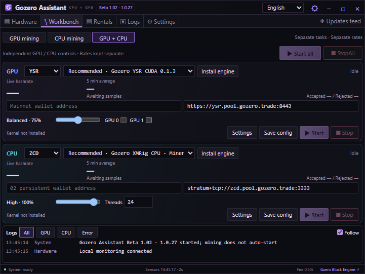
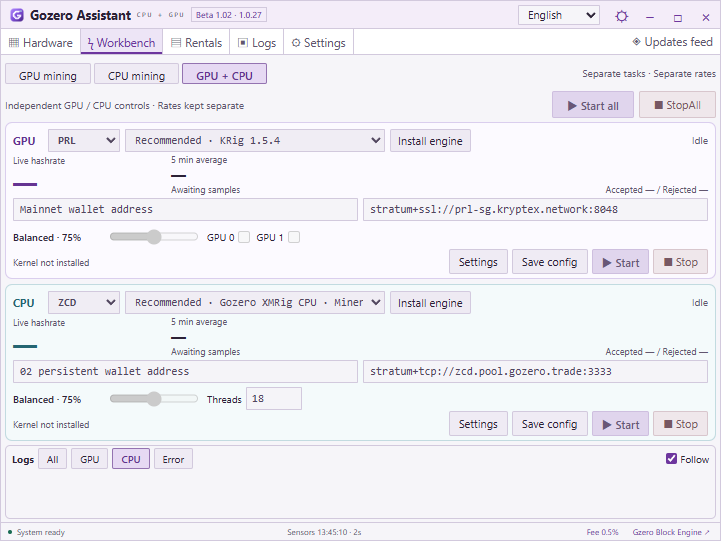

# Gozero Assistant · Beta 1.02 (1.0.27)

**English** | [简体中文](README.zh-CN.md)

A compact Windows GPU / CPU mining assistant with hardware monitoring, a mining workbench, earnings estimates, a rental marketplace, and a floating desktop monitor. **Now includes YSR (GPU) and ZCD (CPU)**, alongside PRL, QTC, and NOID.

[Download for Windows](https://github.com/AlexZeroZero/GozeroAssistant/releases/tag/v1.0.27-beta) · [User guide (Chinese)](desktop/QUICKSTART.txt) · [Build guide (Chinese)](desktop/README.md) · [Website](https://gozero.trade/)

## Download and upgrade

Download `GozerAssistant-1.0.27-win-x64.zip`, verify it against the accompanying SHA256 checksum, extract the entire archive into a new folder, and run `GozerAssistant.exe`. Before upgrading, exit the old version from its system tray menu. Existing wallet addresses, pool settings, and preferences remain stored locally. The app does not start mining automatically.

The display version remains **Beta 1.02**; the internal build version is **1.0.27**.

## Release highlights

- **GPU + CPU mining:** run one GPU coin (PRL, QTC, NOID, or YSR, with one or more GPUs) alongside ZCD on the CPU. Each task has its own wallet, pools, kernel, performance budget, start/stop controls, hashrate history, and logs.
- **Independent accounting:** GPU and CPU rates remain separate. Both tasks accrue the existing 0.5% software fee independently through the same persisted ledger; old balances are preserved.
- **Compact adaptive workbench:** stacked task cards in the small window, side-by-side cards when widened, plus a floating monitor showing both tasks.
- **Light-theme readability:** corrected selected and disabled buttons, input fields, logs, hardware values, and floating-window text.
- **Simplified navigation:** removed the earnings-test page and test buttons. Normal hashrate monitoring, supported pool account data, and earnings estimates remain. Electricity, pool fee, and measured system power settings moved to Preferences.
- **On-demand CPU engines:** the app does not bundle XMRig. Download the source-built Gozero engine or official XMRig explicitly from the workbench. CPU budgets use logical threads; Chinese, English, Japanese, and Russian interfaces are available.

| Coin | Hardware / algorithm | Engine and default connection |
| --- | --- | --- |
| ZCD | CPU / RandomX v2 | Gozero XMRig CPU (0% engine fee) or official XMRig (1% engine fee); `stratum+tcp://zcd.pool.gozero.trade:3333` |
| YSR | NVIDIA SM 8.0+ / SHA-256d | Gozero YSR CUDA 0.1.3; `https://ysr.pool.gozero.trade:8443` |
| NOID | Supported NVIDIA GPUs / Poseidon2b | Suprminer or Fl4shMiner; automatic primary / backup connection selection |
| PRL / QTC | GPUs supported by the upstream miner | KRig; selectable regional nodes and backup pools |

YSR requires a CUDA 13-compatible driver; AMD and CPU mining are not enabled for YSR in this release. TSC mining is not yet available on Windows. ZCD requires at least 4 GiB of available memory. Using every thread does not guarantee the highest hashrate: results depend on the CPU, cache, memory, and system scheduling.

<a id="新版界面截图"></a>

## Screenshots

These are actual **1.0.27 idle-state screenshots**. Values are not simulated mining results; the light-theme preview also demonstrates disabled controls. No pool-accepted shares or earnings are claimed by these images.

### GPU + CPU workbench · dark theme



### GPU + CPU workbench · light theme



### Floating monitor


## More features

- GPU, CPU, memory, motherboard, BIOS, and supported sensor readings. Unavailable values display as “—”.
- Five- or ten-minute average hashrates, recent sample charts, mining logs, and GPU temperature protection (90°C by default). CPU temperature and power monitoring are not integrated; CPU temperature protection is not provided.
- Earnings estimates and address ledgers for supported pools. ZCD price, earnings, and pool settlement data are not yet integrated.
- A draggable floating monitor and system tray controls showing hashrate, performance mode, system load, and stopped status.
- Clore / Vast.ai GPU and CPU rental listings, quick filters for the 4090 / 5090 / 3090 / RTX PRO 6000, hardware details, and rental cost estimates. The app provides listings and links; it does not rent or pay automatically.

[Clore referral link](https://clore.ai/register?ref_id=ebgzlv4d) · [Vast.ai referral link](https://cloud.vast.ai/?ref_id=133254)

## Fees and validation scope

The assistant charges a **0.5% service fee** during mining, accumulated through time sharing. This is not an exact deduction from the number of coins earned. Miner engine fees, pool fees, and electricity costs are separate.

145 automated tests passed, including dual-task scheduling, fee persistence, 128-logical-thread configuration, and owned-process stop isolation. Dual-mode, light-theme, and ZCD UI checks passed. **Real-pool simultaneous GPU + CPU mining has not been tested in this release round.** CPU temperature and power monitoring remain unavailable. See the [validation record](desktop/VALIDATION.md) for scope and package checks.

## Source and building

```powershell
git clone https://github.com/AlexZeroZero/GozeroAssistant.git
cd GozeroAssistant
python desktop/scripts/package.py
```

Requires Windows x64, Python 3.11+, and the .NET Framework C# compiler. Tests require Node.js 22+. The build downloads and verifies a pinned Electron version; it does not start mining. See the [build guide (Chinese)](desktop/README.md).

Gozero-authored assistant code is licensed under [MIT](LICENSE). Upstream YSR code retains its MIT license; Quantus-derived code retains Apache-2.0. See [third-party notices](desktop/THIRD-PARTY.md).

Gozero XMRig CPU is based on XMRig and follows GPL-3.0-or-later; it is not an independently developed algorithm implementation. [Optional CPU engine downloads and complete corresponding source](https://github.com/AlexZeroZero/GozeroAssistant/releases/tag/xmrig-cpu-6.26.0-cpu.2). KRig, Suprminer, Fl4shMiner, and XMRig are downloaded only at the user's request; XMRig is not bundled with the assistant. Mining software may trigger antivirus detection; this project does not promise detection-free binaries.
