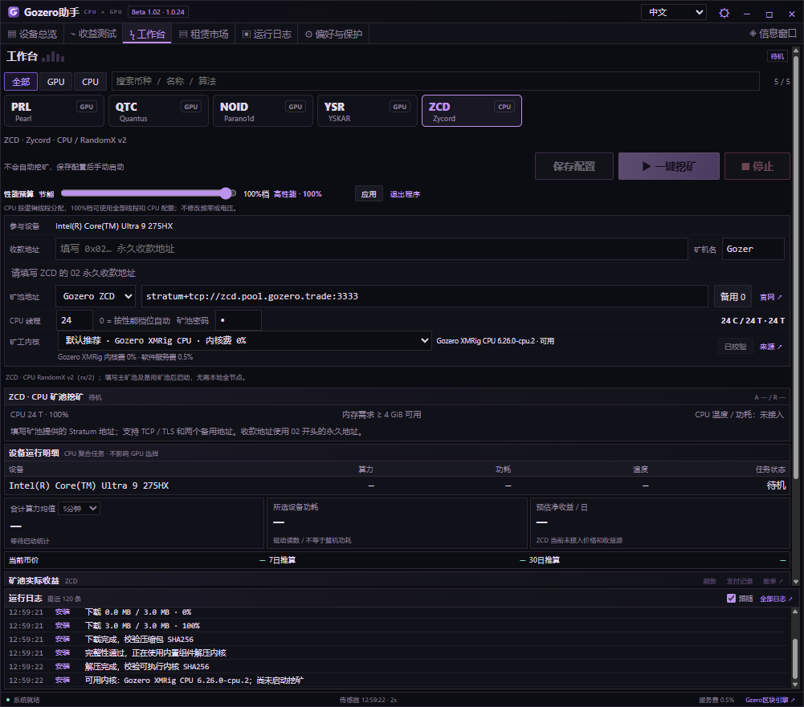
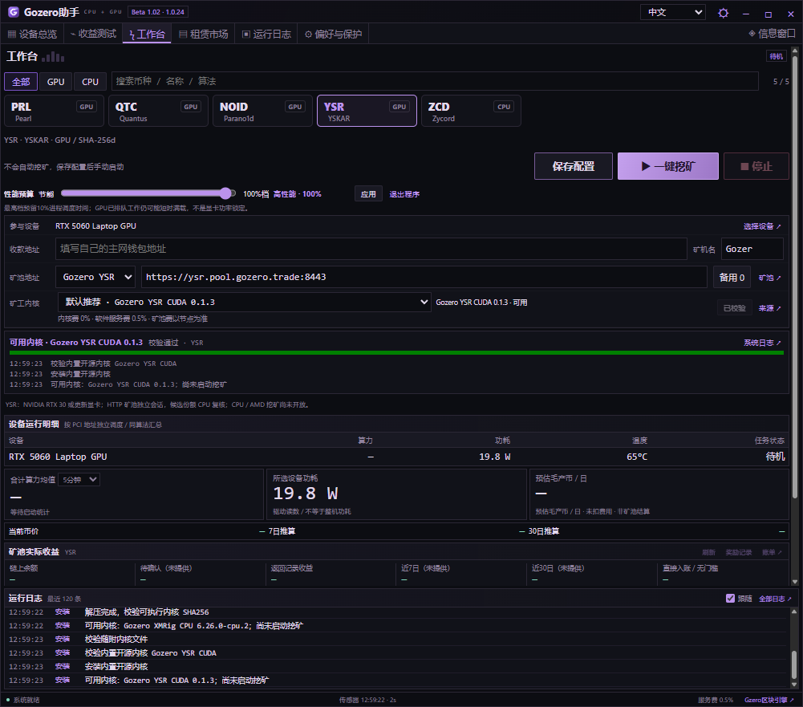
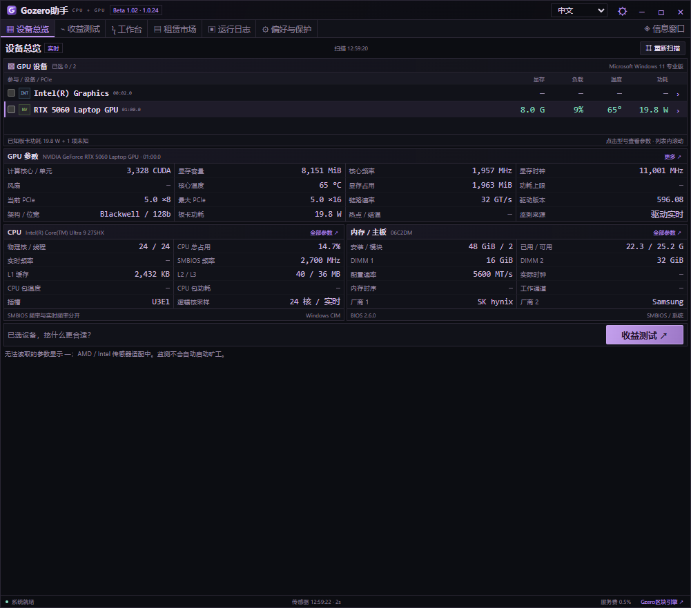

# Gozero助手 · Beta 1.02（1.0.24）

紧凑型 Windows GPU / CPU 挖矿助手：硬件监测、挖矿工作台、收益参考、租赁市场与桌面悬浮监控。**现已接入 YSR（GPU）和 ZCD（CPU）**，同时支持 PRL、QTC、NOID。

[下载 Windows 版](https://github.com/AlexZeroZero/GozeroAssistant/releases/tag/v1.0.24-beta) · [使用指南](desktop/QUICKSTART.txt) · [构建说明](desktop/README.md) · [官网](https://gozero.trade/)

## 下载与更新

下载 `GozerAssistant-1.0.24-win-x64.zip`，核对随附 SHA256，完整解压至新文件夹，运行 `GozerAssistant.exe`。升级前从托盘退出旧版；已有钱包、矿池和配置保存在本机。程序不会自动开始挖矿。

显示版本保持 **Beta 1.02**，内部构建版本 **1.0.24**。

## 本版重点

- **ZCD / Zycord**：CPU RandomX v2（rx/2）矿池挖矿，强制校验02永久地址，支持主矿池与两个备用矿池。
- **YSR / YSKAR**：GPU SHA-256d，接入 Gozero YSR CUDA 内核、网络数据及矿池工作台。
- **CPU线程修正**：按逻辑线程数分配。64核128线程的50% / 75% / 100%档对应64 / 96 / 128线程；100%允许全部线程及完整CPU配额，支持手动设置线程。
- **XMRig按需下载**：主程序不包含XMRig；用户点击“下载并安装”后，分别从官方或Gozero GitHub获取内核，显示进度并验证SHA256。
- **日志与算力修复**：ZCD读取XMRig原生日志，并独立采集启动诊断；恢复工作台算力、曲线与运行日志的数据通道。
- GPU / CPU币种筛选和搜索；租赁列表随窗口尺寸自动填充；中、英、日、俄四种界面语言。

| 币种 | 计算设备 / 算法 | 内核与默认连接 |
| --- | --- | --- |
| ZCD | CPU / RandomX v2 | Gozero XMRig CPU（内核费0%）或官方XMRig（内核费1%）；`stratum+tcp://zcd.pool.gozero.trade:3333` |
| YSR | NVIDIA SM 8.0+ / SHA-256d | Gozero YSR CUDA 0.1.3；`https://ysr.pool.gozero.trade:8443` |
| NOID | 受支持的NVIDIA GPU / Poseidon2b | Suprminer或Fl4shMiner；自动主备连接适配 |
| PRL / QTC | 上游支持的GPU | KRig；可选择地区节点与备用矿池 |

YSR要求兼容CUDA 13的驱动；本版YSR未开放AMD或CPU挖矿。TSC Windows挖矿入口暂未开放。ZCD至少需要4 GiB可用内存；线程开满并不保证获得最高算力，实际表现取决于CPU、缓存、内存与系统调度。

## 新版界面截图

以下为 **1.0.24软件真实界面的待机截图**，展示配置和功能布局；没有填入模拟算力、虚构收益或钱包余额，不代表矿池有效份额验收。

### ZCD · CPU工作台



### YSR · GPU工作台



### 设备总览



## 更多功能

- GPU、CPU、内存、主板、BIOS与受支持的传感器读取；未知值显示“—”。
- 5/10分钟算力均值、近期采样曲线、挖矿日志、显卡温度保护（默认90°C）。CPU温度和功耗尚未接入，不宣称CPU温度保护。
- 收益参考、收益测试与已接入矿池的地址账本；ZCD价格、收益和矿池结算数据尚未接入。
- 可拖动悬浮卡片与托盘；突出算力、当前模式、系统负载和停止状态。
- Clore / Vast.ai GPU和CPU租赁查询，4090 / 5090 / 3090 / RTX PRO 6000快捷筛选、参数窗及租金试算；只查询和跳转，不自动租赁。

[Clore推荐链接](https://clore.ai/register?ref_id=ebgzlv4d) · [Vast.ai推荐链接](https://cloud.vast.ai/?ref_id=133254)

## 服务费与验证范围

助手服务费为 **0.5%**，挖矿和收益测试均适用，按运行时间分时累计，不是按实际产币量精确扣款。内核费、矿池费及电费另计。

137项自动化测试通过，覆盖128逻辑线程配置和CPU100%配额；四语界面测试通过。自编译CPU内核的离线日志与算力读取实测通过；官方XMRig在本机被系统拒绝启动，未完成本轮实机验证。ZCD尚未完成矿池有效份额与结算验收。不同硬件、长期运行、收益和杀毒软件兼容性不作保证。

## 开源与构建

```powershell
git clone https://github.com/AlexZeroZero/GozeroAssistant.git
cd GozeroAssistant
python desktop/scripts/package.py
```

需要Windows x64、Python 3.11+和.NET Framework C#编译器；测试需Node.js 22+。构建会下载并校验固定版本Electron，不会开始挖矿。详见[构建说明](desktop/README.md)。

助手自有代码采用[MIT](LICENSE)；YSR上游代码保留MIT，Quantus派生代码保留Apache-2.0。[第三方组件说明](desktop/THIRD-PARTY.md)。

Gozero XMRig CPU基于XMRig，遵循GPL-3.0-or-later，并非从零编写的独立算法实现。[独立内核下载及完整对应源码](https://github.com/AlexZeroZero/GozeroAssistant/releases/tag/xmrig-cpu-6.26.0-cpu.2)。KRig、Suprminer、Fl4shMiner和XMRig均需用户主动下载；XMRig不随助手安装包分发。挖矿程序可能触发杀毒软件检测，项目不提供“免报毒”承诺。
