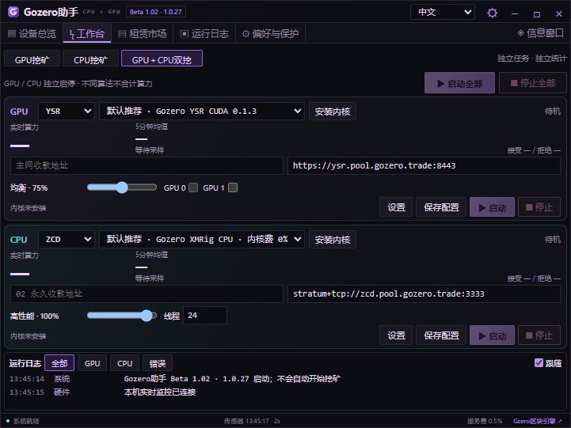
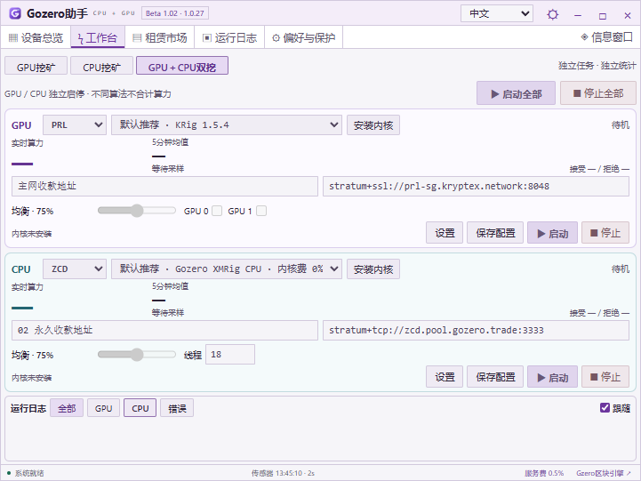
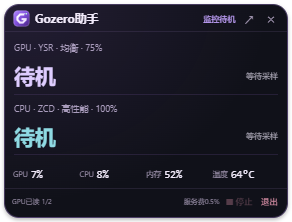

# Gozero助手 · Beta 1.02（1.0.27）

[English](README.md) | **简体中文**

紧凑型 Windows GPU / CPU 挖矿助手：硬件监测、挖矿工作台、收益参考、租赁市场与桌面悬浮监控。**现已接入 YSR（GPU）和 ZCD（CPU）**，同时支持 PRL、QTC、NOID。

[下载 Windows 版](https://github.com/AlexZeroZero/GozeroAssistant/releases/tag/v1.0.27-beta) · [使用指南](desktop/QUICKSTART.txt) · [构建说明](desktop/README.md) · [官网](https://gozero.trade/)

## 下载与更新

下载 `GozerAssistant-1.0.27-win-x64.zip`，核对随附 SHA256，完整解压至新文件夹，运行 `GozerAssistant.exe`。升级前从托盘退出旧版；已有钱包、矿池和配置保存在本机。程序不会自动开始挖矿。

显示版本保持 **Beta 1.02**，内部构建版本 **1.0.27**。

## 本版重点

- **GPU＋CPU双挖**：一组GPU（PRL / QTC / NOID / YSR，支持多卡）与ZCD CPU同时运行；两路独立配置钱包、矿池、内核、性能预算，独立启停、算力曲线与日志。
- **分别统计与计费**：不同算法不合计算力；两路分别累计原有0.5%软件服务费，共享持久化账本并保留旧余额。
- **紧凑布局**：小窗口上下排列，拉宽后并排显示；悬浮卡片同时显示GPU和CPU状态。
- **浅色主题修复**：提高选中按钮、禁用控件、输入框、日志、硬件参数及悬浮窗文字的可读性。
- **移除收益测试**：取消独立板块与测试按钮，保留工作台正常算力监控、矿池账本和收益估算；电价、矿池费、整机功耗参数移至“偏好与保护”。
- **CPU内核按需下载**：不随软件打包XMRig；用户可选择下载Gozero自编译版或官方版。线程预算按逻辑线程计算；保留中英日俄四语界面。

| 币种 | 计算设备 / 算法 | 内核与默认连接 |
| --- | --- | --- |
| ZCD | CPU / RandomX v2 | Gozero XMRig CPU（内核费0%）或官方XMRig（内核费1%）；`stratum+tcp://zcd.pool.gozero.trade:3333` |
| YSR | NVIDIA SM 8.0+ / SHA-256d | Gozero YSR CUDA 0.1.3；`https://ysr.pool.gozero.trade:8443` |
| NOID | 受支持的NVIDIA GPU / Poseidon2b | Suprminer或Fl4shMiner；自动主备连接适配 |
| PRL / QTC | 上游支持的GPU | KRig；可选择地区节点与备用矿池 |

YSR要求兼容CUDA 13的驱动；本版YSR未开放AMD或CPU挖矿。TSC Windows挖矿入口暂未开放。ZCD至少需要4 GiB可用内存；线程开满并不保证获得最高算力，实际表现取决于CPU、缓存、内存与系统调度。

## 新版界面截图

以下为 **1.0.27真实待机界面截图**，浅色图同时展示禁用控件效果；未填入模拟算力、收益或钱包余额，不代表矿池有效份额验收。

### GPU＋CPU工作台 · 深色



### GPU＋CPU工作台 · 浅色



### 双路悬浮监控



## 更多功能

- GPU、CPU、内存、主板、BIOS与受支持的传感器读取；未知值显示“—”。
- 5/10分钟算力均值、近期采样曲线、挖矿日志、显卡温度保护（默认90°C）。CPU温度和功耗尚未接入，不宣称CPU温度保护。
- 收益参考与已接入矿池的地址账本；ZCD价格、收益和矿池结算数据尚未接入。
- 可拖动悬浮卡片与托盘；突出算力、当前模式、系统负载和停止状态。
- Clore / Vast.ai GPU和CPU租赁查询，4090 / 5090 / 3090 / RTX PRO 6000快捷筛选、参数窗及租金试算；只查询和跳转，不自动租赁。

[Clore推荐链接](https://clore.ai/register?ref_id=ebgzlv4d) · [Vast.ai推荐链接](https://cloud.vast.ai/?ref_id=133254)

## 服务费与验证范围

助手服务费为 **0.5%**，挖矿任务适用，按运行时间分时累计，不是按实际产币量精确扣款。内核费、矿池费及电费另计。

145项自动化测试通过，覆盖双任务调度、账本持久化、128逻辑线程配置及进程停止隔离；双挖、浅色主题和ZCD界面检查通过。**本轮尚未进行真实矿池GPU＋CPU同时挖矿实测。** CPU温度与功耗仍未接入。完整范围及安装包校验见[验证记录](desktop/VALIDATION.md)。

## 开源与构建

```powershell
git clone https://github.com/AlexZeroZero/GozeroAssistant.git
cd GozeroAssistant
python desktop/scripts/package.py
```

需要Windows x64、Python 3.11+和.NET Framework C#编译器；测试需Node.js 22+。构建会下载并校验固定版本Electron，不会开始挖矿。详见[构建说明](desktop/README.md)。

助手自有代码采用[MIT](LICENSE)；YSR上游代码保留MIT，Quantus派生代码保留Apache-2.0。[第三方组件说明](desktop/THIRD-PARTY.md)。

Gozero XMRig CPU基于XMRig，遵循GPL-3.0-or-later，并非从零编写的独立算法实现。[独立内核下载及完整对应源码](https://github.com/AlexZeroZero/GozeroAssistant/releases/tag/xmrig-cpu-6.26.0-cpu.2)。KRig、Suprminer、Fl4shMiner和XMRig均需用户主动下载；XMRig不随助手安装包分发。挖矿程序可能触发杀毒软件检测，项目不提供“免报毒”承诺。
