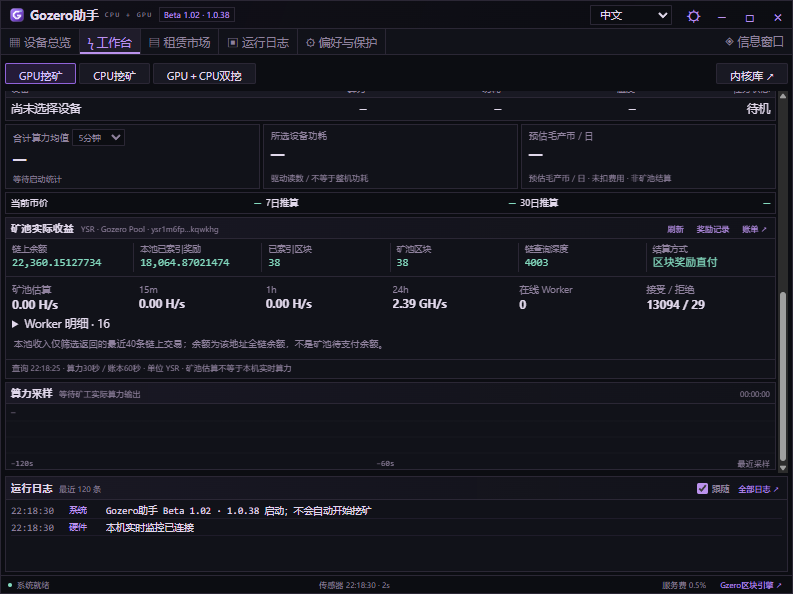

# Gozero助手 · Beta 1.02（1.0.38）

[English](README.md) | **简体中文**

紧凑型 Windows GPU / CPU 挖矿助手，提供硬件监测、GPU＋CPU 独立双挖、矿池账本、租赁市场与桌面悬浮监控。

[下载 Windows 版](https://github.com/AlexZeroZero/GozeroAssistant/releases/tag/v1.0.38-beta) · [官网](https://gozero.trade/) · [使用指南](desktop/QUICKSTART.txt) · [构建说明](desktop/README.md)

## 下载与升级

下载 `GozerAssistant-1.0.38-win-x64.zip`，核对随附 SHA256，完整解压到新目录，运行 `GozerAssistant.exe`。升级前从托盘退出旧版。已有钱包、矿池与设置保留；程序不会自动开始挖矿。显示版本仍为 **Beta 1.02**，内部版本 **1.0.38**。

## 本版更新

- **YSR / ZCD / BNT 矿池查询**：接入 Gozero Pool 的公开地址接口，显示矿池估算算力、Worker、接受/拒绝份额、余额和分页支付记录。双挖模式可分别查看 GPU / CPU 任务账本。
- **区分金额性质**：YSR 全链余额与本池已索引奖励分开；ZCD/BNT 分别显示可用未支付、待成熟、支付预留、累计已支付。BNT 待成熟明确标注 PPLNS 可变预估。
- **精确金额与缓存**：8位最小单位整数字符串 / BigInt 换算；算力约30秒、账本约60秒刷新。错误时退避并保留缓存，未知值不补零，自定义矿池不冒充 Gozero 收益。
- **BNT 多内核**：默认 Gozero Blocknet CPU 0.2.1，新增 Seine 0.2.15 按需下载和选择；官方 Core 0.20.0 单列下载，属于需同步链的全节点程序，不能作为工作台矿池内核。
- **BNT 性能与内存**：按可用内存和逻辑线程设置预算，预留系统空间；支持大页设置及自研内核自动调优。新增 AVX2 stream 为实测候选，保留原默认路径。

| 币种 | 设备 / 算法 | 内核与默认矿池 |
| --- | --- | --- |
| BNT | CPU / Argon2id，每线程2 GiB | 自研核心或 Seine；`stratum+tcp://bnt.pool.gozero.trade:14444` |
| ZCD | CPU / RandomX v2 | Gozero XMRig CPU 或官方 XMRig；`stratum+tcp://zcd.pool.gozero.trade:3333` |
| YSR | NVIDIA SM 8.0+ / SHA-256d | Gozero YSR CUDA；`https://ysr.pool.gozero.trade:8443` |
| NOID | 受支持 NVIDIA / Poseidon2b | Suprminer 或 Fl4shMiner，支持主备选择 |
| PRL / QTC | 上游支持的 GPU | KRig，支持地区节点和备用矿池 |

YSR 需要兼容 CUDA 13 的驱动，未开放 AMD/CPU；TSC Windows 未开放。ZCD 至少需要4 GiB可用内存；BNT 约2 GiB＋128 MiB/线程并预留系统内存。线程越多不一定越快。

## 当前界面

以下是 **1.0.38 的真实公开地址查询截图**。本机处于待机，数值来自矿池估算与既有账本，不代表新增收益或本机实时算力。





## 其它功能

- GPU＋CPU 两路独立钱包、矿池、内核、启停与日志，不合计不同算法算力；提供5/10分钟均值。
- 硬件扫描、支持的实时传感器、可拖拽悬浮窗、托盘操作；GPU温度保护默认90°C。CPU温度与功耗尚未接入。
- 中文、英文、日文、俄文；深色与浅色主题。
- Clore / Vast.ai GPU、CPU租赁报价与型号筛选；软件不会自动租赁或支付。

[Clore 推荐链接](https://clore.ai/register?ref_id=ebgzlv4d) · [Vast.ai 推荐链接](https://cloud.vast.ai/?ref_id=133254)

## 费用与验证范围

助手收取公开的 **0.5% 分时服务费**，不是按实际币数精确扣款；内核费、矿池费和电费另计。自研 BNT 内核费0%；原版 Seine 内核费 **2.5%**（bntpool域名1%）。官方 XMRig 1%，Gozero CPU版内核费0%。

182项自动测试与真实只读接口/UI验证通过。**Seine 在测试机内从助手启动时被 Windows 拒绝（错误码5），用户确认腾讯管家弹出拦截；助手内实挖尚未验收通过。** 未绕过安全软件。BNT性能依设备和线程数变化，不承诺3995WX或AVX-512提升。详见[验证记录](desktop/VALIDATION.md)。

## 开源与构建

```powershell
git clone https://github.com/AlexZeroZero/GozeroAssistant.git
cd GozeroAssistant
python desktop/scripts/package.py
```

需要 Windows x64、Python 3.11+、.NET Framework C#编译器；测试需要Node.js22+。构建校验固定版本Electron，不启动挖矿。

助手代码采用[MIT](LICENSE)，第三方组件保留各自许可证，见[第三方说明](desktop/THIRD-PARTY.md)。Gozero XMRig遵循GPL-3.0-or-later，[内核与对应源码](https://github.com/AlexZeroZero/GozeroAssistant/releases/tag/xmrig-cpu-6.26.0-cpu.2)。KRig、Suprminer、Fl4shMiner、XMRig、Seine均由用户手动下载；不承诺免报毒。
