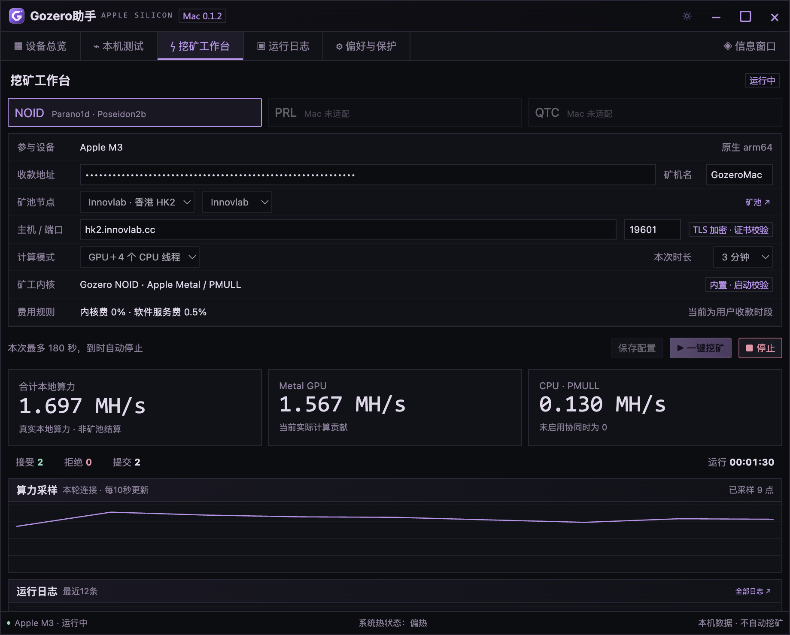
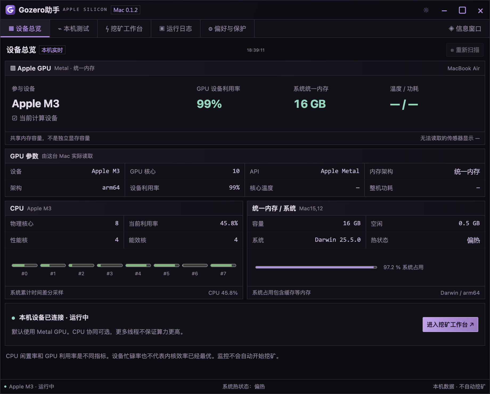
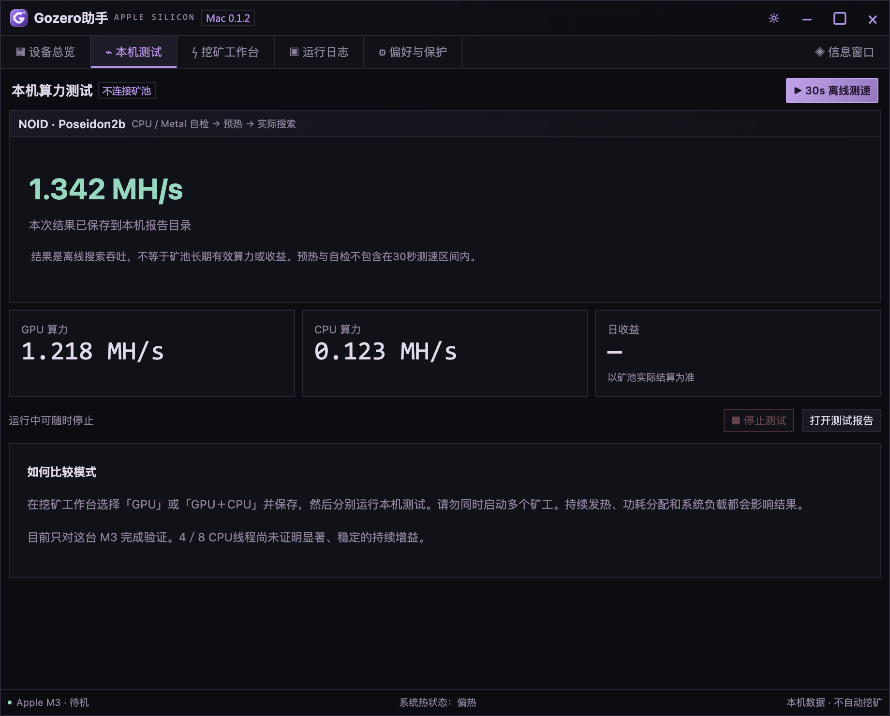

# Gozero助手 Mac 0.1.2

Apple Silicon 原生版本，支持 NOID 的 Metal GPU 挖矿及可选的 CPU PMULL 协同计算。沿用 Gozero助手的界面风格，包含设备监控、钱包与矿池配置、算力曲线、有效份额、日志、离线测速和深浅主题。

## 下载与运行

从 [Mac 0.1.2 发布页](https://github.com/AlexZeroZero/GozeroAssistant/releases/tag/mac-v0.1.2) 下载 `Gozero-Assistant-Mac-0.1.2-arm64.zip`，解压后打开 `Gozero助手.app`。需要 Apple Silicon 和 macOS 13.5 或更新版本；运行不需要安装 Node、Python 或 Xcode。

在“挖矿工作台”填写自己的 NOID 主网收款地址，选择矿池及计算模式，再点击“一键挖矿”。默认只使用 GPU，可选 GPU＋2／4／8 个 CPU 线程。CPU 协同能实际参与运算，但开更多线程不保证总算力更高。

每次运行可选 1／3／5／10 分钟，到时自动停止。关闭窗口或退出应用会停止内核，最小化保持任务运行。配置保存在 `~/Library/Application Support/gozero-assistant-mac/`，启动应用不会自动挖矿。

这是当前功能范围的首次正式 GitHub 发布，不代表 Windows 全部功能已完成移植。PRL、QTC、浮窗、托盘、租赁、自动更新和不限时挖矿尚未提供。内核费 0%，沿用原版公开的 0.5% 软件服务费。

应用使用 ad-hoc 签名，尚无 Developer ID 签名或 Apple 公证。若从 GitHub 下载后被 macOS 阻止，可确认下载来源与 SHA256 后，在“系统设置 → 隐私与安全性”查看该应用的“仍要打开”选项；无需关闭系统安全保护。

## 性能与实测范围

已验证设备：Apple M3 MacBook Air，16 GB 统一内存、10 核 GPU、4 个性能核与4 个能效核。其他 M 系列尚未实机验证。

本版使用已验证的六位分组基底转换内核。在三次等工作量交替对比中，GPU 约从 1.756 MH/s 提高到 1.782–1.784 MH/s，提升约 1.5%。先前 GPU＋4 CPU 线程的15秒离线短测曾达到约2.073 MH/s；这不是持续算力或矿池结算算力保证。

发布验收使用正式安装包、独立配置、GPU＋4 CPU 线程，执行180秒矿池任务和30秒离线测速。实际计数、算力和环境记录见发布附件 `VALIDATION.json`。算法自检、候选CPU复核、自动时限停止、配置持久化和界面布局均在验收范围内。

下列图片直接截取自 M3 上运行的应用。收款地址输入框按密码形式显示以保护隐私，算力、份额、运行时间与设备数据未修改。截图是一个时刻的本地测量，不能代替长期矿池结算数据。温度及功耗无法读取时显示“—”。

## 校验与构建

发布附件提供 `SHA256SUMS.txt`、`BUILD-MANIFEST.json` 和 `VALIDATION.json`。可用 `shasum -a 256 Gozero-Assistant-Mac-0.1.2-arm64.zip` 对照校验值。

源码保留在 `codex/macos-apple-silicon` 分支及 `mac-v0.1.2` 标签，Windows 分支及既有发布不变。构建流程见 `desktop/macos/gui/README.txt`，算法归属与 Apache-2.0 许可见 `desktop/experiments/noid-apple/NOTICE`。应用内含 Electron、Chromium、Node 和原生内核的许可证。
